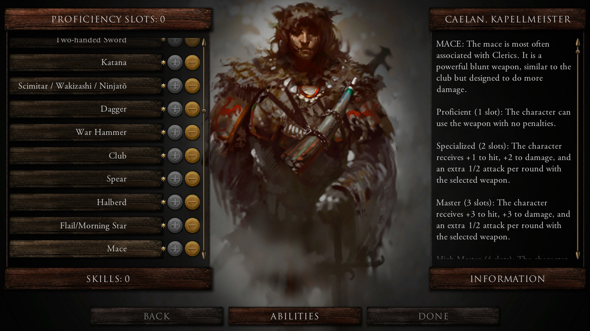
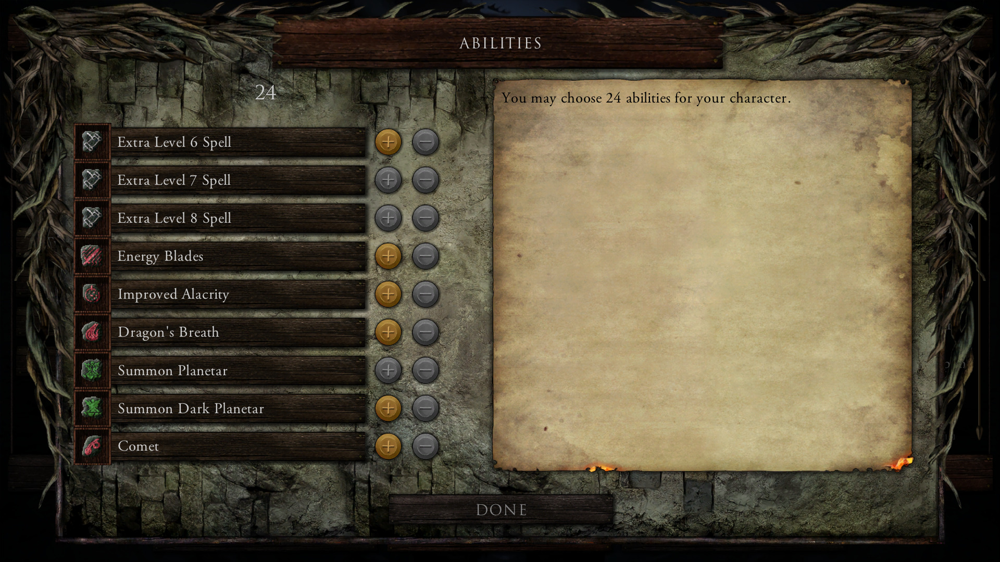
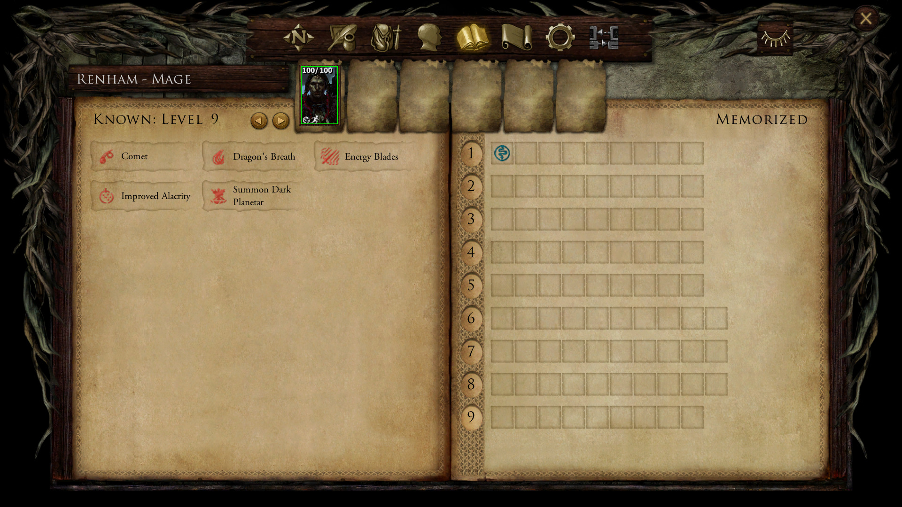
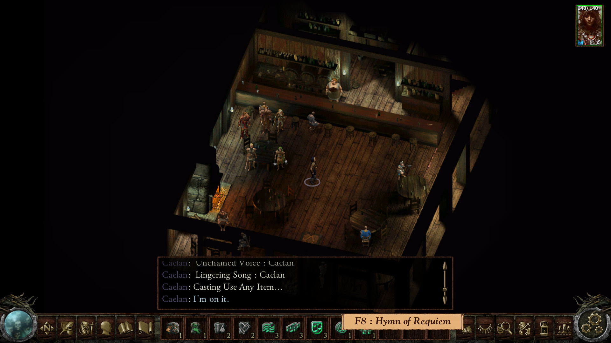
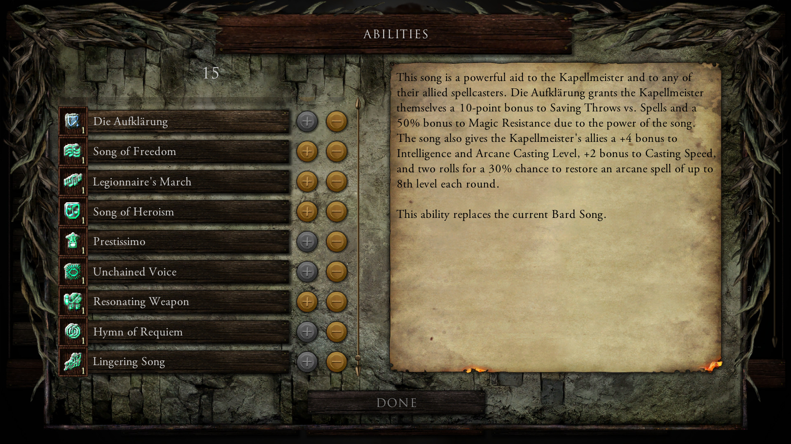
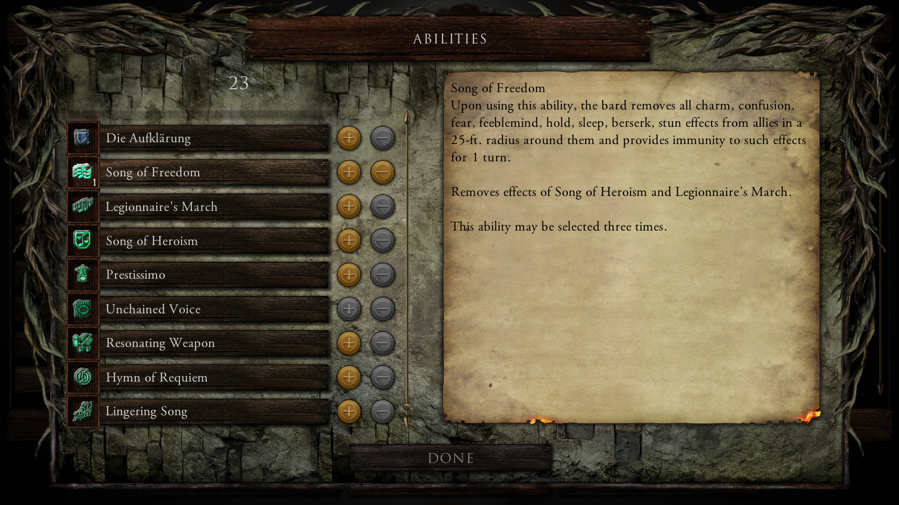
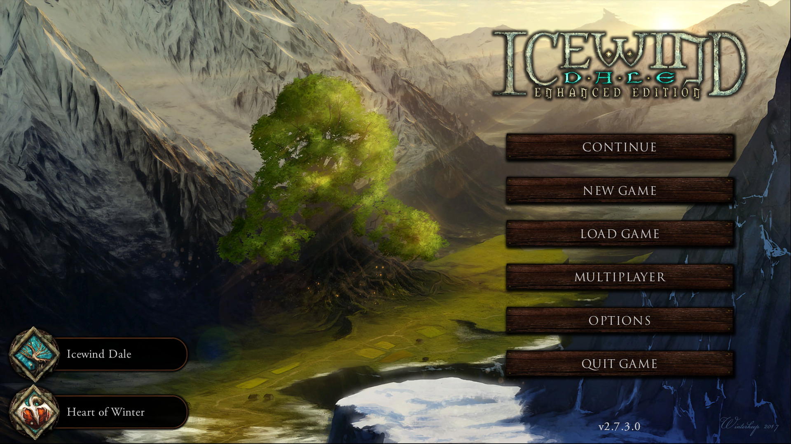

# IWDEE Tweaks and Fixes

**Version 0.3b**

A WeiDU collection for **Icewind Dale: Enhanced Edition**, focused on compatibility fixes and convenience tweaks for modded installations, especially installations using **Infinity UI++**.

## Screenshots

In-game screenshots from the validated IWDEE v2.7.3.0 test setup using Infinity UI++ and Skills and Abilities #710/#720. They show the HLA level-up entry point, HLA selection interface, high-level spell/ability availability, and custom-kit HLA handling.

  
  

  
  

  
  

  

## Components

### 0. Enable BG2-style HLAs in IWDEE

Standalone Infinity UI++ support for the BG2-style HLA level-up workflow in IWDEE.

The component:

- enables the HLA interface already present in Infinity UI++;
- applies the IWDEE HLA compatibility fixes used by the current setup;
- repairs the Bardic Wonders vanilla-class HLA routing issue when detected, removing only misplaced `C0BWHL*` Bard HLA rows from the vanilla Paladin table and restoring them to the vanilla Bard table while leaving Bard kits unchanged;
- removes redundant Tracking from Ranger/Ranger-kit HLA tables only when that class or kit already receives Tracking normally;
- preserves shared HLA tables by cloning and rerouting only affected Ranger classes/kits;
- recognizes native and compatible replacement Tracking resources used by modded installations.

**Requirements:** IWDEE and Infinity UI++ installed first.

### 1. Expanded Triple-Class HLA Tables

Adds dedicated HLA handling for **Fighter/Mage/Thief** and **Fighter/Mage/Cleric**, adapting the behavior of Tweaks Anthology component #2300 to IWDEE.

The expanded tables retain the **Extra 6th-, 7th-, and 8th-Level Spell** HLAs and trade some abilities from the non-mage classes for additional high-level mage abilities:

- **Fighter/Mage/Cleric**
  - **Loses:** Deathblow, Greater Deathblow, War Cry
  - **Gains:** Improved Alacrity, Dragon's Breath, Summon Planetar / Summon Dark Planetar, Comet

- **Fighter/Mage/Thief**
  - **Loses:** Deathblow, Greater Deathblow, War Cry, Alchemy, Scribe Scrolls
  - **Gains:** Energy Blades, Improved Alacrity, Dragon's Breath, Summon Planetar / Summon Dark Planetar, Comet

The tables are built from the installation's current resources when necessary so earlier mod changes are preserved. An XP-cap removal such as Tweaks Anthology #2090 is recommended for normal access to the high-level mage abilities.

### 2. Thief Skill Points in Multiples of Five

IWDEE/Infinity UI++-safe adaptation of the SCS thief-skill tweak. It makes thief skill assignment operate in steps of five and rounds `THIEFSKL.2DA` point awards to multiples of five without activating Infinity UI++'s commented Lua/UI copies.

Do not combine it with SCS #4115.

### 3. Remove Summoning Cap for Celestials

IWDEE adaptation of Tweaks Anthology #2340. It changes only the `CELESTIAL` limit in `SUMMLIMT.2DA` to `999`, effectively removing the one-active-Planetar/Deva restriction while preserving unrelated summon limits.

This component has been validated in-game on IWDEE v2.7.3.0 with multiple celestial summons active simultaneously.

### 4. Make Enhanced Bard Song Switchable (Experimental)

Creates a seventh selectable Bard Song entry for the BG2-style **Enhanced Bard Song** HLA and dynamically follows the installation's current Bard Song resources instead of assuming vanilla names.

The component:
- detects the actual Change Bard Song target used by `SPCL920.SPL`;
- creates `IWTFBS7.SPL` from the current IWDEE selector structure;
- grants the selector when Enhanced Bard Song is selected as an HLA;
- removes only `SPCL920` spell immunities that block genuine Bard Song switchers;
- recognizes Skills and Abilities #131's separate Enhanced Skald Song and creates a dedicated `IWTFSK7.SPL` selector without changing the S&A song payload or its gameplay effects;
- replaces only the unchanged stock Curran Strongheart and Tymora's Melody portrait icons with IWDEE's native **Resist Fear** and **Good Luck** icons, while preserving icons already changed by other mods;
- integrates dynamically with Bardic Wonders' Revised Bard Song Mechanics when those runtime resources are present;
- preserves the Bardic Wonders cooldown/aura behavior instead of reverting EBS to a vanilla modal song;
- registers EBS with the installed `C0IWSONG` / `C0SINGI2` state and cleanup behavior where applicable.

**Runtime validation:** Enhanced Bard Song is selectable, switches correctly with the normal songs, keeps the Bardic Wonders cooldown behavior, remains active while the Bard attacks or casts, applies the real EBS effects, and displays the corresponding portrait status icons.

The classic-song icon corrections are validated in game: Curran Strongheart's War Chant uses **Resist Fear**, Tymora's Melody uses **Good Luck**, and the other classic songs retain the Bard Song note.

Bardic Wonders and Skills and Abilities are not dependencies for component #4. Install Skills and Abilities #131 before component #4 if you want the separate Enhanced Skald Song selector.

### 5. Bardic Wonders Extend Revised Bard Song Mechanics to IWDEE Classic Songs (Experimental)

**Optional component:** this component is completely optional. Install it only if you already use Bardic Wonders' **Revised Bard Song Mechanics** and want those mechanics extended to IWDEE's six classic selectable Bard Songs.

Compatibility extension for **Bardic Wonders' Revised Bard Song Mechanics**.

On IWDEE, the six classic selectable Bard Songs can escape Bardic Wonders' normal song-discovery condition and remain modal even while its revised runtime is installed. Component #5 extends the installed revised mechanics to `#BARD1` through `#BARD6` without redistributing Bardic Wonders files.

The component:
- discovers each classic selector's current Change Bard Song target dynamically;
- preserves the current song payload and earlier mod changes;
- builds compatible aura/cooldown wrappers from an already-working transformed Bard Song in the installation;
- creates only IWDEE Tweaks and Fixes-owned payload resources (`IWTFS1` through `IWTFS6`);
- preserves already-transformed songs instead of replacing their wrappers;
- maintains Bardic Wonders' IWDEE selection state with `C0IWSONG` values 1-6;
- registers the classic songs with `C0SINGI2` cleanup handling;
- mirrors Bardic Wonders' optional overhead visual on all six classic songs when `C0BSNGEF.SPL` is present;
- uses explicit 8-byte resref writes where required by SPL/EFF fields.

**Requirement if installed:** Bardic Wonders' **Revised Bard Song Mechanics** must already be installed. Component #5 requires its runtime resources (`C0BARDX.SPL`, `C0BARDSX.SPL`, and `C0SINGI2.SPL`) and will not install without them.

**Runtime validation:** all six classic IWDEE songs apply their intended effects, use the Bardic Wonders cooldown behavior, remain active while the Bard attacks or casts, switch correctly between songs, and interoperate with `C0IWSONG` / `C0SINGI2` state and cleanup handling. With Bardic Wonders' optional overhead-visual component installed, all six classic songs also display the same overhead visual used by supported Bardic Wonders songs.

## Recommended install order

1. Install Infinity UI++.
2. Install Ranger/Bard kits and class-overhaul mods whose final resources should be detected.
3. Install Bard/class/song mods that should modify the base Bard Song resources before the compatibility layer.
4. Install Bardic Wonders components you plan to use before the corresponding compatibility fix: its HLA overhaul before IWDEE Tweaks and Fixes #0, and Revised Bard Song Mechanics / optional Bard Song Overhead Visual Effect before #5.
5. Install IWDEE Tweaks and Fixes **#0**.
6. Optionally install **#1**.
7. If used, install Skills and Abilities **#710** and **#720**; skip **#730**.
8. Install IWDEE Tweaks and Fixes **#4** after mods that change `SPCL920.SPL` or Bard Song selectors, and after Skills and Abilities **#131** if its Enhanced Skald Song is used.
9. Optionally install IWDEE Tweaks and Fixes **#5** after Bardic Wonders Revised Bard Song Mechanics and after other tweaks to the six classic IWDEE songs.

## Compatibility notes

- **Infinity UI++:** required (install early)
- **Skills and Abilities:** optional. Components that add new abilities and update existing abilities are supported. Component #4 can add a selector for #131's Enhanced Skald Song when #131 is installed first, without changing its song effects. Not compatible with component **"Add HLAs to IWDEE (Lefreut UI Required)"**
- **Bardic Wonders:** completely optional for the mod as a whole. Component #0 contains a targeted repair for the tested IWDEE vanilla Bard/Paladin HLA routing issue when Bardic Wonders' HLA rows are already present. Bardic Wonders is required only if you choose component #5, which extends its installed **Revised Bard Song Mechanics** to the six classic IWDEE songs and also mirrors its optional overhead visual when that resource is installed.
- **Tweaks Anthology:** not compatible with component that expand HLA triple-class table. An XP-cap removal such as #2090 is recommended for component #1.
- **Sword Coast Stratagems:** SCS #4115 not compatible with component #2.

## Credits and attribution

- Skills and Abilities, by Grammarsalad and morpheus562.
- Tweaks Anthology / The Gibberlings Three.
- Sword Coast Stratagems, by David Wallace.
- IWDification, by CamDawg and DavidW.
- Bardic Wonders / The Artisan's Corner.
- Infinity UI++.
- WeiDU and the Infinity Engine modding community.

No third-party packaged resources from those projects are redistributed by IWDEE Tweaks and Fixes. See `THIRD_PARTY.md` for detailed attribution and `LICENSE` for this project's license.
